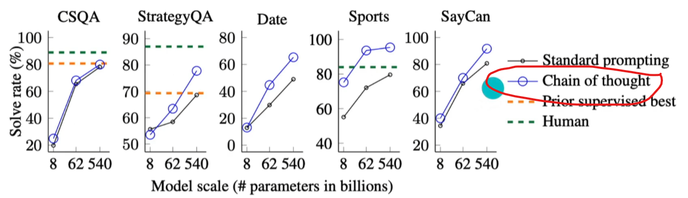

# Course Notes

## Introduction to Prompt Engineering

### What is Prompt Engineering

-   Prompt: Instructions and context provided to an AI for a certain
    task.

-   Prompt Engineering: The practice of developing and optimizing
    prompts to efficiently use an AI for a certain task.

-   To get a high-quality accurate result you need to be able to
    optimize your prompts.

-   To craft a good prompt you need to help the AI understand the
    purpose and context of your task.

-   We need to understand the capabilities of these LLM's and their
    limitations.

-   LLM's are sensitive to the way prompts are framed.

-   A multidisciplinary branch of engineering focused on interacting
    with Artificial intelligence through the integration of fields
    including Software Engineering, Machine Learning, Cognitive Science,
    Business, Philosophy, Psychiatry, Computer Science.

### Why is Prompt Engineering Even a Thing?

-   The larger the model size the more abilities emerge.

-   Once LLM's Model scale (training FLOPs) got to around the size
    10\^22 The abilities of LLM's exploded.

-   It was also scientifically proved that changing the way LLM's were
    prompted coaxed more abilities out of them. Even in smaller LLM's

-   LLM's were never actually trained to do the things it does. We don't
    know exactly how they do it. Prompt Engineering is part of the quest
    to figure this out.

-   Improving prompt quality by 5 does not necessarily improve LLM
    result performance by 5. The prompt could spark something and leaps
    in LLM ability can be uncovered.

### Breaking GPT

-   The only time LLM's think is when they are typing

-   So they will think in the order they type. Or in the order you
    prompt it to type.

-   Prompting LLM's to do task in the right order can have significant
    effect on it's performance and the results that appear.

### Applied Prompt Engineering

-   Applying prompt engineering principles, knowledge, and skills to
    real-world tasks.

### Large language models can do jaw-dropping things. But nobody knows exactly why.

-   <https://www.technologyreview.com/2024/03/04/1089403/large-language-models-amazing-but-nobody-knows-why/>

-   Figuring out why LLM's can do amazing things is a key to big steps
    forward in AI.

### Emergent Abilities of Large Language Models

-   <https://arxiv.org/pdf/2206.07682>

-   This published study considers an ability to be emerging if it is
    not present in smaller models but is present in larger models.

-   The emergence of such abilities raising the question of whether
    further scaling could expand the range of abilities of LLM's.

-   1 Introduction

    -   Emergence is when quantitative changes in a system result in
        qualitative changes in behaviour.

-   2 Emergent Abilities Definition

    -   An ability is emergent if it is not present in smaller models
        but is present in larger models.

    -   When visualised via a scaling curve where x axis is model scale
        and y axis is performance, performance is almost random until a
        certain point in the x model scale size when performance becomes
        consistently considerably better than random.

    -   This qualitative change is known as phase transition.

    -   Today's language models have been scaled primarily along three
        factors:

        -   Amount of computation

        -   Number of model parameters

        -   Training data set size

    -   FLOPS or floating-point operations per second, is a metric for
        computer performance that quantifies the number of
        floating-point calculations a system can perform in one second.

    -   Model parameters typically scale in line with training compute
        FLOPS.

    -   Emergent abitlities rely heavily on Model parameters and
        training compute scaling past a larger enough point.

    -   Emergent abilities also rely on other factors such as not being
        limited by the amount of data, it's quality, or the number of
        parameters in the model.

    -   Today's models are likely not trained optimally and this will
        improve in the future.

    -   This paper aims to discuss examples of emergent ability in prior
        work.

-   3\. Few-Shot Prompted Tasks

    -   Few-Shot Prompting: A prompt engineering technique where you
        insert examples in your prompt, training the model on what you
        want the prompt to look like.

    -   {width="5.828393482064742in"
        height="3.959640201224847in"}

    -   Few-Shot Prompting performance is random until a certain point
        of training compute and then accuracy of the Few-Shot prompting
        improves significantly.

-   Augmented Prompting Strategies

    -   Reasoning tasks, especially those that involve multiple steps
        have been challenging for LLM's

    -   Chain of thought prompting:

        -   A prompting strategy that helps get better results from
            LLM's when multi step reasoning is required for a task.

        -   Process of guiding LLM's to produce a sequence of
            intermediate steps before giving final response.

        -   Only showed better results when 10\^23 FLOPs scale was
            reached.

    -   Instruction Tuning:

        -   Another strategy to communicate with LLM's

        -   Involves giving LLM instructions but not few-shot examples.

        -   Only improves performance with much greater computation as
            well.

    -   Program execution and model calibration are other strategies.

    -   Typically it did not matter which strategy was used, it wasn't
        until the LLM got large enough (more FLOPs, more parameters)
        that these emergent new abilities started to appear.

-   Discussion

    -   Further scaling could lead to more emergent abilities.

    -   New architecture, higher quality data, or improved training
        procedures could help us see new emergent abilities in smaller
        models. Scale won't necessarily be the only factor. There is
        some evidence of this already when comparing models.

    -   Pre training could help us get more emergent abilities too.

    -   Once emergent abilities appear in larger models we can
        hypothesize as to why and implement into the architecture or how
        we work with smaller models.

### Applied Prompt Engineering With NASA

-   Training for way longer than we think might be all it takes in some
    instances to help an LLM be successful in completing tasks
    successfully.

-   Burda and Edwards of OpenAI tried to teach an LLM to do basic
    Arithmetic and it was failing. And then it worked. The LLM could do
    basic arithmetic. And what was the trick. Simply doing more of the
    same. It's seems there is a tipping point for some abilities that
    when the LLM get's enough data, enough examples, a big enough data
    set it can then learn on it's own. On this occasion the pair just
    gave the model way more examples of the arithmetic it wanted it to
    solve and presto, it worked.

-   A lot of current AI advancements have come through trial and error
    rather than understanding what these LLM's do and how or why they do
    it.

### Applied Prompt Engineering With NASA

-   BIDARA:

    -   A ChatGPT based chatbot that was instructed using prompt
        engineering.

    -   Can guide users through the Biomimicry Institute's Design
        Process, which is a step by step method to propose biomimetic
        solutions.

    -   <https://github.com/nasa-petal/bidara> shows a massive prompt
        NASA used to create BIDARA.

    -   Bigger isn't always better with prompts.

    -   The prompt:

        -   Tells ChatGPT it is an expert in a certain field.

        -   Tells ChatGPT it's goal.

        -   Effectively creating a custom ChatBot using ChatGPT

        -   It creates a user workflow by telling ChatGPT to prompt the
            user through a series of steps to complete a task. This
            makes the process more user friendly with checks and
            reminders to do a good and complete job.

        -   It creates a process of digestible steps for ChatGPT to
            follow.

        -   Breaking tasks down into smaller clear steps for ChatGPT
            helps it be more accurate.

        -   It requests the model to provide peer reviewed sources for
            it's information. This biases the model towards being more
            accurate and avoiding hallucinations. This does not always
            work but where you can, bias the model towards being more
            accurate or effective.

        -   Asking ChatGPT for evidence is one way of biasing it towards
            being more accurate.

        -   This prompt gets the model to provide in depth explanations
            for what it says.

        -   Provides extra helpful information.

        -   Provides hints to help guide the model.

### Why Is Prompt Engineering Important To You

-   It's the key to using ChatGPT's potential, productively and
    efficiently, to achieve your specific needs and goals while avoiding
    errors and biases.

-   Sam Altman said, "Writing a really great prompt for a chatbot
    persona is an amazingly high-leverage skill and an early example of
    programming in a little bit of natural language.

-   Andrej Karpathy said, "The hottest new programming language is
    English.

-   Prompt engineering is effectively programming using natural
    language.

-   Prompt engineering like programming is about using frameworks, the
    words in the right order and principles to solve a problem.

-   ChatGPT is leader in most metrics right now.

-   ChatGPT uses the GPT model.

-   Different models have different strengths and weaknesses. Different
    use cases perhaps.

-   <https://platform.openai.com/playground/chat?models=gpt-3.5-turbo>

    -   The open ai playground

### Multi-Modality and Tools in LLMs

-   ChatGPT can understand text and write text but it can also do other
    things.

-   You can upload an image to ChatGPT for context and then ask
    questions, ask ChatGPT to solve a problem.

-   ChatGPT can also produce images.

-   ChatGPT can also access the internet and browse.

-   Beware ChatGPT can hallucinate and is not always reliable. It can
    confidently give a clear answer and be wrong.

-   Chat GPT can do python code execution. An example of this would be
    asking ChatGPT to calculate the Fibonacci sequence up to the 10^th^
    number. ChatGPT would then write the python code to do this,
    interpret and run the code and then give the result.

-

## How LLM's Work

### Introduction to LLM's

-   NLP, Natural Language Processing:

    -   A branch of computer science.

    -   A branch of artificial intelligence.

    -   Focuses on giving computers the ability to understand text and
        spoken words. To process natural language.

-   LLM's:

    -   Large: lots of data, mostly text from the internet. And lots of
        parameters.

    -   Language: focused on natural language text as opposed to say
        computer code.

    -   Model: A machine learning system trained to perform certain
        tasks.

### Tokens

-   At a high level you can think of tokens as words.

-   Tokens are the way LLM's, like ChatGPT, learn and speaks.

-   We use words, LLM's use tokens.

-   Each word is NOT a token.

-   LLM's break down words into smaller pieces which are the tokens.

-   Open AI says that 1 token is equal to about 0.75 words.

-   Some words are broken down into multiple tokens. But we don't know
    why?

-   There are about 50,000 tokens.

-   Each token has a token ID.

-   LLM's like ChatGPT are like a word guessing machine in that they
    look for patterns in text to predict what word should come next.
    They don't actually think about something and come put with an
    answer? They just write a sentence by learning from text and
    predicting what words come one after another?

### Word Guessing Machines?

### Thinking Like LLMs -- Roll a Dice

-   Chat GPT and other LLMs won't necessarily give you a random number.
    If you ask it to roll a dice it might surmise that the most common
    words to follow such a question is 'The result is:' And then it
    might determine that 4 is the most common word or thing to follow
    that. It won't do the maths and determine a random number but rather
    the number or word that more often than not follows the words that
    preceded it.

### Inside LLMs

-   GPT 3 is an LLM with 175billion parameters spread across 96 layers,
    trained on 300 billion tokens.

-   Tokens: broken down word parts.

-   300 billion tokens is about 45 TB of text data (books, articles,
    websites etc.)

-   If you have a blog or ever wrote something online it was probably
    used to train these LLM's

-   The inside of an LLM works a little like neurons in a brain and
    looks like this:

-   {width="6.268055555555556in"
    height="3.520138888888889in"}

-   Each of these dots is a neuron divided into different layers. GPT 3
    has 96 of these layers.

-   Parameters:

    -   175 billion of them in GPT 3

    -   An umbrella term that encompasses:

        -   Calculations going on inside the LLM

        -   Two key types of parameters: weights and biases

        -   Weights are the lines between the neurons. Each weight is a
            calculation.

        -   At ach neuron there is a bias which can be also thought of
            as a calculation.

        -   The weights and biases make up the total number of
            parameters.

        -

        -

-   All the 96 layers except for the input and output layers are called
    hidden layers.

-   We don't know why when we pass something into and through these 175
    billion parameters, we get the token that we do. Why it is accurate.

-   {width="6.268055555555556in"
    height="3.4055555555555554in"}

-   The more tokens you train an LLM on and the more parameters there
    are, the smarter the LLM gets.

### The Transformer Model

-   The key that unlocked LLM's as we know them today.

-   LLMs can pay attention to large amounts of text allowing it to get
    better context to help it determine what token or word should come
    next.

-   GPT: Generative Pre-trained Transformer.

### The Training Process

-   The LLM llama-2-70b, Meta's LLM consists of one two files. A 140 GB
    parameters file and a run.c file containing 500 lines of code.

-   This computer program utilising these two files requires and
    extensive and expensive training process to make it all work.

-   The training process can be broken down into two steps.

    -   Pre-training

        -   Side note: There is no actual training phase.

        -   Text data, the training data, a whole lot of it, is taken
            from the internet (and other places?)

        -   -\> It is then run through a lot of GPU's

            -   It takes millions of dollars and weeks and weeks, even
                months to process this text data.

        -   -\> Determines how parameters and weights calculate things

            -   The program recognises patterns in the text data that us
                used to set parameter and weight values that will in
                turn determine whether a signal between "neurons" gets
                minified or amplified

            -   Another way of looking at it, is it is compressing the
                data. It is lossy compression as you can't get the
                original data back like unzipping a file.

        -   At the end of this pre-training phase we have a base model
            that has some incredible abilities due to it being able to
            now predict what word (or token) comes next.

        -   This Base Model is not the same things that we know of as a
            LLM.

        -   This Base Model does not speak to you like a chatbot or have
            q and a abilities. It has not been Fine Tuned.

    -   Fine-tuning

        -   First a whole bunch of people, under strict guidelines, feed
            the Base Model a lot of ideal questions and answers. This
            will result in the parameters and weight values being
            adjusted again.

        -   From here it will learn the ability to take in a question
            and provide an answer.

        -   We don't really know why feeding the model these q and a's
            teaches the model that it should be giving q and a's. We
            just know that it does.

        -   Mechanistic Determinability is the field of trying to figure
            out what is happening in there.

    -   RLHF

        -   Another step that sometimes occurs.

        -   The model gives answers and humans rank them.

    -   The result: Assistant Model

        -   Base Model + Fine-tuning = Assistant Model

        -   Assistant model is what we would likely interact with.

        -   Think ChatGPT

### Thinking Like LLMs -- The Reversal Curse

-   If A = B, then B = A

-   LLM's trained on A=B do not learn that B=A

-   Just because it knows A \> Mary Lee Pfeiffer is, B \> Tom Cruise's
    mom does not mean it knows that B \> Tom Cruise is, A \> Mary Lee
    Pfeiffer's son.

### AGI Artificial General Intelligence

-   Artificial intelligence that is at the human level.

-   ASI, Artificial Superintelligence is different. Better or smarter
    than humans.

-   The current ChatGPT models are not considered AGI or ASI

-   Sparks of Artificial General Intelligence: Early experiments with
    GPT-4:

    -   Is a Microsoft Research article.

    -   The paper proposes that GPT-4 could be an early version of AGI.

### The World of LLM's

## Our Prompting Framework

-   She Standard Prompt: a prompt consisting of only a questions or
    instruction. The basic building block of prompt engineering.

## Prompting Fundamentals - The Setup

-   The System Message
    -   Also called the system prompt
    -   Initial prompt provided to the model by it's creator
    -   guides the model even before we start interacting with it.
    -   For example before you even chat with ChatGPT for the first time it has already been pompted with somehting like:
        > "You are ChatGPT, a large language model based on the GPT-4o-mini model and trained by OpenAI. Current date: 2025-03-16
        > Image input capabilities: Enabled Personality: v2..."
-   The system message is very powerful. it can be used to give it a certain bias, personality, to shape the answers a certain way.
-   After the systme message there is a specific user message. This can include context for the AI like the user is a web developer, they like detailed answers and sources, they are studying this class and that class.

### Context What is it?

-   More context = better result
-   More information in a prompt = better result
-   Chat GPT can infer from information you give. EG you might ask about a restaurant and share the context of it being a special date, you want it to be romatic and it is in XYZ location. The AI can then not only suggest a restaurant but also may infer that you might like the option of a romatic walk at the local nearby beach after and provide details for that too.

### Context - The Context Window

-   Too much context can negatively impact your result
-   This is becuase ChatGPT has a token limit.
-   1 token = 0.75 words approx
-   Token limit = Context Window
-   This token limit is kind of like the amount or words the AI can keep in its head at one time.
-   ChatGPT 4: 8192 tokens, approx 6000 words (double prev chatgpt verson)
-   Claude 2 has 100,000 token limit
-   Model creators are always looking to increase this limit.
-   Technically ChatGPT has no memory?
-   Every time you send a prompt, your entire prompt history is tacked onto that prompt.
-   This tacked on history counts as tokens against the token limit.
-   When we write a prompt, if it goes over the token limit, the AI will remove past tokens to make way for the new tokens in a first in first out fashion.
-   Therefore we will lose context that may be important, or expexted to be part of the conversation, if we say too much.
-   Managing the token limit is crucial to maintaining the accuracy and coherence of a model's outputs.
-   Claud 2 with its very large token limit/context window may be better for large documents or when lots of context is required.
-   For the model you're chatting with (GPT-4-turbo), the context window is 128,000 tokens. approx 96000 words.
-   When providing a lot of context, ChatGPT remembers what you say at the start and end of your text better than the model.
-   In some cases too much context gets worse results than no context at all.
-   LLM performance decreases as the context increases.
-   Be precise.

### Personas and Roles

-   Telling the model what it is EG a 9th grade teacher, a senior programmer.
-   By giving the model a persona we give it more context
-   Personas give more accurate outputs.
-   We should always provide the model with a persona.
-   Improves our ability to engage with the model.
-   Could be used for:
    -   Create character outlines and then ask ChatGPT to play out a scene to create a script
    -   Start a debate and and get good debate points you could use.
    -   Chat to and learn from your heroes.
    -   Give your chatbot a style to interact with your customers

## Prompting Fundamentals - The Instructions

-   Be clear and specific
-   Using delimeters like ```, ###, ======, <data></data>, -----, can help communicate more clearly your message to the model.
-   Be consistent with delimeters. Use bullet points, ordered or unordered where it makes sense.
-   Delimiters like ,|; and new line can be useful to make a message clearer too.
-   Ask specifically for what you actually want, keep it simple and clear. If you want to get the file extension for a filename using python ask, "I want to get the file extension for any file using python." Don't for example guess at the solution and ask for the last 3 characters in the filename. Ask for what you actually want.
-   Goals are better than solutions. Your prompt should contain your goal, what you want to acheive rather than your proposed solution for getting there.
-   Zero shot prompting: LLM can do something with out any further training from me.
-   One shot prompting: Giving one example or exemplar of the result we want. EG Multiply 6 by 10 --- (and now for the one shot) Use this format as an example: Mulitply 4 \* 10: 40
-   Few shot prompting: When you give a few examples to train the model first before asking it for an answer.
-   
-   Adding a few shots, a few examples can increase accuracy by as much as 50%, especially in bigger models.
-   How many exmples works best: 4-8 examples is ideal. After 8 there is very little gain in accuracy.
-   When giving an example showing the LLM the chain of though you would use can help it give a better answer. EG instead of The answer is 11, write the chain of though that lead you to 11 in the example answer.
-   
-   Chain of thought prompting allows the model to break down larger problems into multiple smaller simpler steps.
-   Because the model then shows chain of thought in it's answer it allow you to debug and see where they went wrong in there chain of thought.
-   Even when providing no examples, just be saying, "Let's think step by step", can help the model be more accurate.

## Guided Project - Create Your Own Career Coach

-
